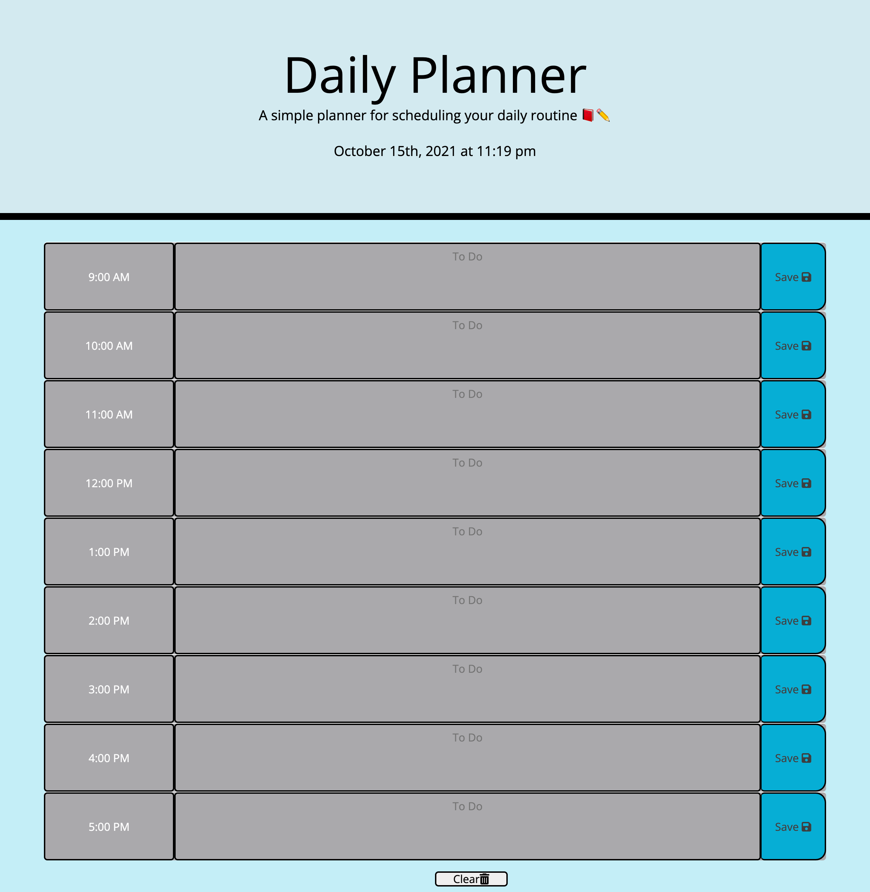

# day-planner

Week 5 homework where we had to create a day planner using what we've learned in the past with HTML, CSS, Javascript and recently JQuery, Bootstrap and API's. The planner allows you to enter information in the To Do section and then save that information in local storage. The different times of the day also show in different colors depending on whether time is in in the past, present, or future. 

# Usage

<a href="https://hayleymchugh.github.io/day-planner/">Deployed Day Planner</a>

<a href="https://github.com/HayleyMcHugh/day-planner.git">Github</a>